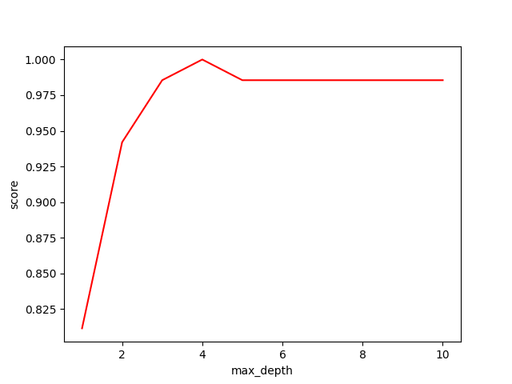
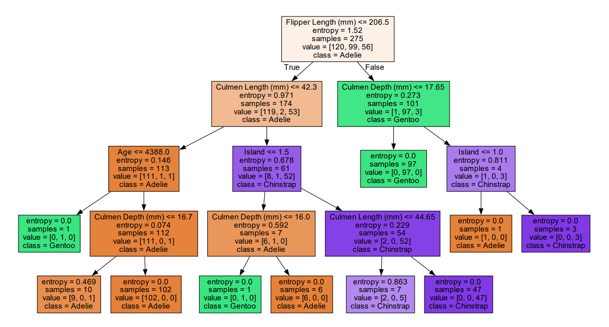
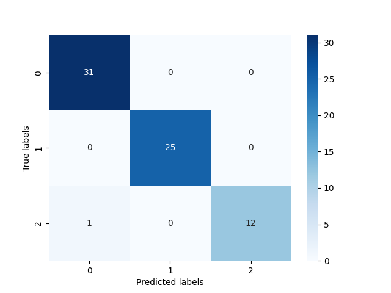

# 基于决策树的企鹅分类

## 实验目的

采用决策树算法对企鹅进行分类

## 数据集介绍

- 样本总数：344
- 7个特征变量（所在岛屿，嘴巴长度，嘴巴深度，脚蹼长度，身体体积，性别以及年龄）
- 一个目标分类变量（三种企鹅类别：Adélie, Chinstrap, Gentoo）
- 部分样本含有缺失值 NA


## 数据处理

**导入包**

有时候python找不到graphviz包的位置，我们要手动告诉它。？？？？？？？这里是路径，你应该填自己的graphviz bin地址 

```python
import graphviz as graphviz
import numpy as np
import pandas as pd
import matplotlib.pyplot as plt
import seaborn as sns
from sklearn.model_selection import train_test_split
from sklearn.tree import DecisionTreeClassifier
from sklearn import metrics
from sklearn import tree
import os

# 有时候python找不到graphviz包的位置，我们要手动告诉它
os.environ["PATH"] += os.pathsep + '？？？？？？'

```

**导入数据、补全缺失值和类型变量转换**

```python
# 导入数据集
data = pd.read_csv(open(r'.\data\penguin.csv'))
# 利用-1补全缺失值 【这里用其他的方法 比如平均值补全，中位数补全会更好】
data = data.fillna(-1)
# 将类型变量转换为值变量
data['Species'] = data['Species'].apply(trans)
data['Island'] = data['Island'].apply(trans)
data['Sex'] = data['Sex'].apply(trans)
```

用到的**转换函数**如下：

```python
# 将分类变量转化成数字变量，方便后续计算
def trans(x):
    if x == data['Species'].unique()[0]:
        return 0  # Adelie
    if x == data['Species'].unique()[1]:
        return 1  # Gentoo
    if x == data['Species'].unique()[2]:
        return 2  # Chinstrap
    if x == data['Island'].unique()[0]:
        return 0  # Torgersen
    if x == data['Island'].unique()[1]:
        return 1  # Biscoe
    if x == data['Island'].unique()[2]:
        return 2  # Dream
    if x == data['Sex'].unique()[0]:
        return 0  # male
    if x == data['Sex'].unique()[1]:
        return 1  # female
    if x == data['Sex'].unique()[2]:
        return -1  # -1
```


## 决策树的生成和测试

将处理后的数据分为特征数据和目标数据

```python
feature_data = data[['Island', 'Culmen Length (mm)', 'Culmen Depth (mm)', 'Flipper Length (mm)', 'Body Mass (g)', 'Sex', 'Age']]
goal_data = data[['Species']]
```

将特征数据进行训练集和测试集的划分（20%的测试集，80%的训练集，random_state是伪随机数种子）

```python
x_train, x_test, y_train, y_test = train_test_split(feature_data, goal_data, test_size=0.2, random_state=2022)
```

在生成最终决策树之前，为了更好的效果，我们可以设置的一些超参数如下：

- 采用的判断方法 criterion：gini系数 还是 entropy, 可以像这样设置：criterion = 'entropy'
- 决策树的最大层数 max_depth：在本实验中，因为本身数据很少，在层数过高比如说到了7层后，它的重要性已经很低了，有可能训练出来的结果反而不好，适当的剪枝可以获得更好的效果。

 我们这里以 max_depth 为例子，把它的超参数学习曲线画出来如下：



输出结果：`该决策树的最佳层数是： 4`

绘制代码如下：

```
test = []
for i in range(10):
    clf = tree.DecisionTreeClassifier(criterion='entropy',
                                      max_depth=i + 1,
                                      random_state=2020,
                                      # 最大深度
                                      splitter='best'
                                      )  # 生成决策树分类器   entropy

    clf = clf.fit(x_train, y_train)
    score = clf.score(x_test, y_test)
    test.append(score)

plt.plot(range(1, 11), test, color='red')
plt.ylabel('score')
plt.xlabel('max_depth')
plt.show()
max = test.index(max(test)) + 1
print("该决策树的最佳层数是：", max)
```

将训练集用来生成决策树并进行预测

```
# 生成决策树
penguin_tree = DecisionTreeClassifier(criterion='entropy',
                                      splitter='best',
                                      random_state=2022,
                                      max_depth=max)
penguin_tree.fit(x_train, y_train)

# 返回预测的准确度
print('训练集预测成功率:', penguin_tree.score(x_train, y_train))
print('测试集预测成功率:', penguin_tree.score(x_test, y_test))
```

## 结果可视化

### 决策树

利用 `graphviz`这个库来绘画决策树：

```python
# 画决策树
feature_names = ['Island', 'Culmen Length (mm)', 'Culmen Depth (mm)',
                 'Flipper Length (mm)', 'Body Mass (g)', 'Sex', 'Age']
target_names = ['Adelie', 'Gentoo', 'Chinstrap']

plot_feature_importances(penguin_tree.feature_importances_, 'Charcteristic importance',
                         penguin_tree.feature_names_in_,
                         normalize=False)

dot_data = tree.export_graphviz(penguin_tree,
                                feature_names=feature_names,
                                class_names=target_names,
                                out_file=None,
                                filled=True)

graph = graphviz.Source(dot_data)
graph.render("penguin_tree")
```

我们训练集生成的决策树如下：



每个结点上的解释：

- 第一行 Flipper Length <= 206.5 是 判断条件
- 第二行 entropy 是该特征值计算出来的熵
- 第三行 samples 是目前层数的样本树
- 第四行 value 是每一个类的样本数（本实验有三类）
- 第五行是目前层数判断的类别

### 混淆矩阵

```python
confusion_matrix = metrics.confusion_matrix(penguin_tree.predict(x_test), y_test)
plt.figure()
sns.heatmap(confusion_matrix, annot=True, cmap='Blues')
plt.xlabel('Predicted labels')
plt.ylabel('True labels')
plt.show()
```

本次实验的混淆矩阵图如下：


